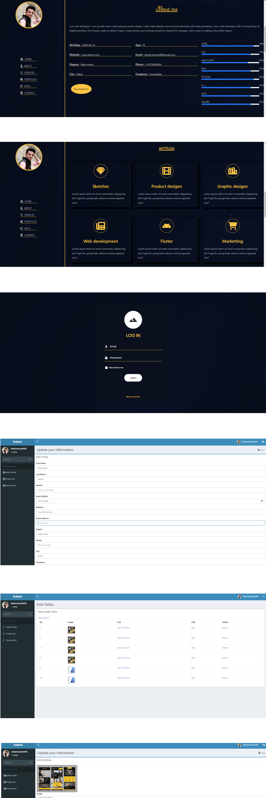

# Portfolio
The Portfolio is a modern web app written in php.
This portfolio website provides standard and modren portfolio functionality.

Portfolio ships regularly with new features and bug fixes. You can get the latest version of Portfolio from here.


  

## Features
- Create, Read, Update and Delete you education information.
- Create, Read, Update and Delete you experience information.
- Create, Read, Update and Delete you a beautiful bootstrap made blog post.
- Create, Read, Update and Delete you personal information
- Authentication and Authorization.

## Getting started
Prerequisites:
- Your computer must be running PHP 8 atleast.


- Get the code:
    ```
    git clone git@github.com:Abdulraziqrohilli/Portfolio.git
    ```

## License
Copyright (c) Rohilli. All rights reserved.
